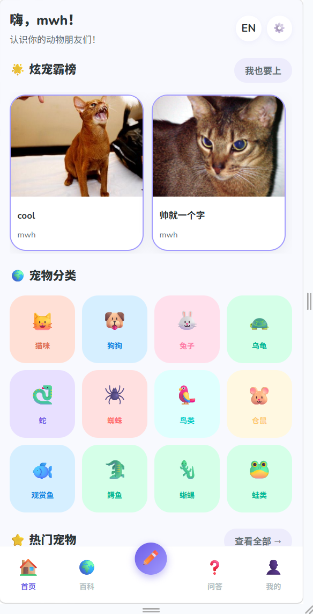
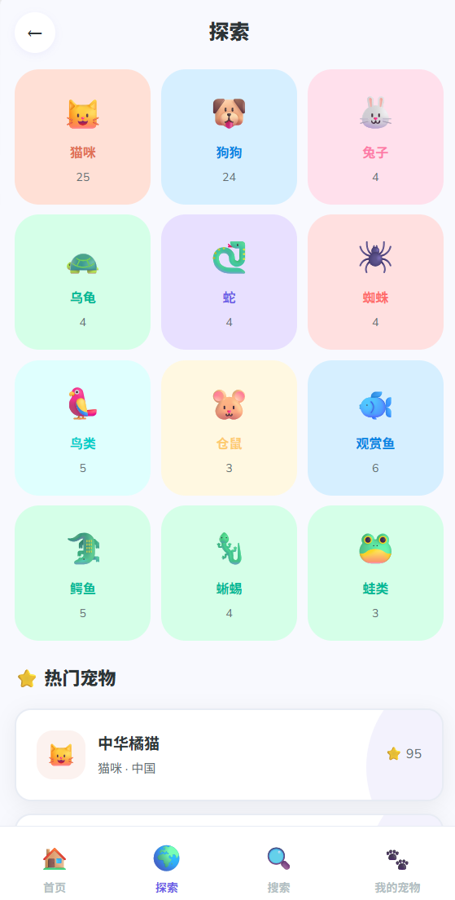
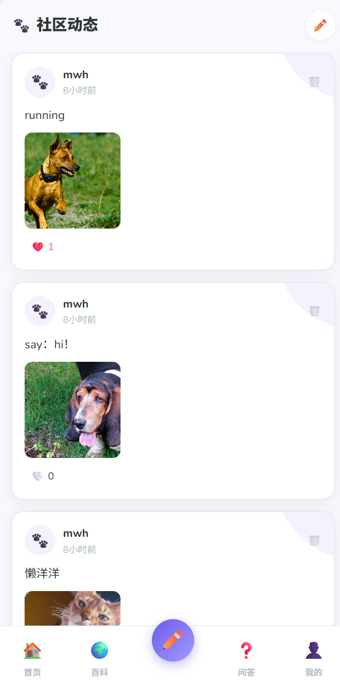
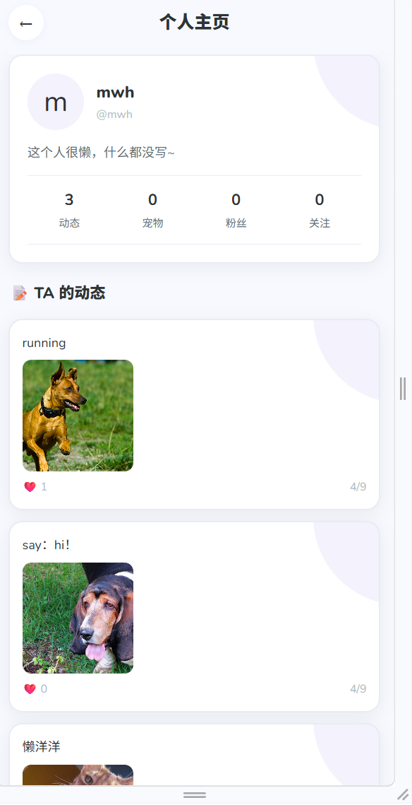
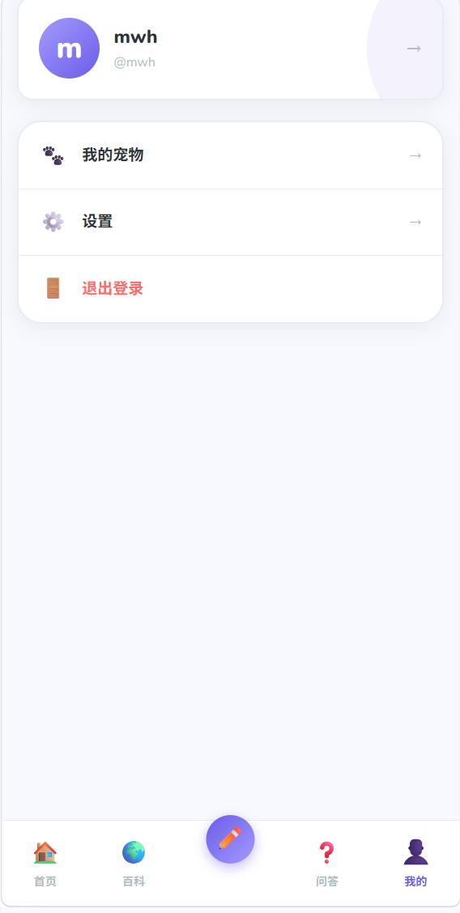

# 🐾 PetWorld 宠物百科社区

一个宠物主题的社区 App，可以查百科、发动态、问问题。用 Vue3 + Node.js 写的，能打包成 iOS/Android App。


---

## 截图

| 首页 | 百科 | 社区 |
|:---:|:---:|:---:|
|  |  |  |

| 问答 | 个人主页 | 我的 |
|:---:|:---:|:---:|
|  |  |  |

---

## 功能

- **宠物百科** — 12 个分类，91 个品种，中英双语
- **社区动态** — 发帖、点赞、传图
- **问答区** — 提问、回答、采纳最佳答案
- **用户系统** — 注册登录、关注、个人主页
- **宠物档案** — 记录自家宠物的信息和日记

---

## 技术栈

**前端**
- Vue 3 + Vite + Pinia
- Vue Router + Vue I18n（中英双语）
- Capacitor（打包 App）

**后端**
- Node.js + Express
- SQLite（sql.js，纯 JS 实现，不用安装）
- JWT 登录鉴权

---

## 本地运行

```bash
# 安装依赖
npm install
cd server && npm install && cd ..

# 一键启动（Windows）
启动社区版.bat
```

或者手动：
```bash
# 终端 1
cd server && node server.js

# 终端 2
npm run dev
```

访问 http://localhost:5173

---

## 项目结构

```
petworld/
├── src/           # 前端代码
├── server/        # 后端 API
├── docs/          # 截图和文档
├── dataset/       # 宠物数据（91 品种）
└── README.md
```

---

## App 打包

```bash
npm run build
npx cap sync
npx cap open ios      # 需要 Mac
npx cap open android  # 需要 Android Studio
```

---

## 关于

- 作者：[Mwh040118](https://github.com/Mwh040118)
- 数据：整理自公开资料，含 11 种中国本土品种
- UI 灵感：Pokémon 图鉴风格

---

有问题提 Issue，欢迎 PR。
